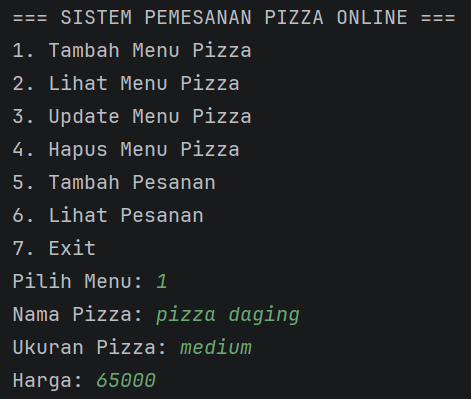
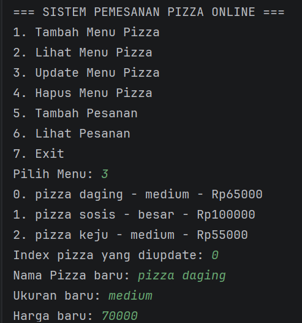
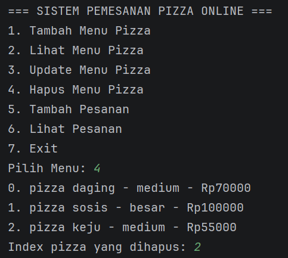
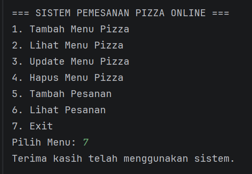

# Sistem Pemesanan Pizza Online

## Deskripsi
Program ini merupakan sistem sederhana untuk mengelola pemesanan pizza menggunakan bahasa Java dengan konsep Object Oriented Programming (OOP)
Program menggunakan ArrayList untuk menyimpan data dan memiliki fitur CRUD.

## Class yang Digunakan
1. Pizza
2. Pesanan
3. Main

## Fitur Program
SISTEM PEMESANAN PIZZA ONLINE
1. Tambah Menu Pizza
2. Lihat Menu Pizza
3. Update Menu Pizza
4. Hapus Menu Pizza
5. Tambah Pesanan
6. Lihat Pesanan
7. Exit

### Manajemen Menu Pizza
- Tambah menu pizza
- Lihat menu pizza
- Update menu pizza
- Hapus menu pizza

### Manajemen Pesanan
- Tambah pesanan
- Lihat pesanan

## Konsep yang Digunakan
- Class dan Object
- Constructor
- Method
- ArrayList
- Perulangan (Loop)
- Switch Case
- CRUD

## Cara Menjalankan Program
Compile program: jalankan program

## ss program
## tambah menu program

## lihat menu program

## update menu program

## hapus menu program

## tambah pesanan program

## lihat pesanan program

## exitprogram

