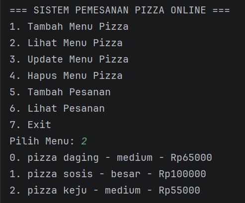
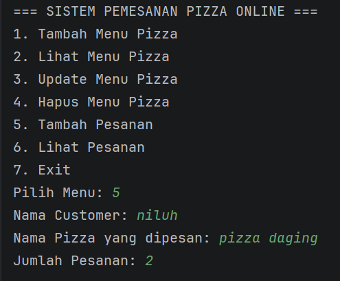
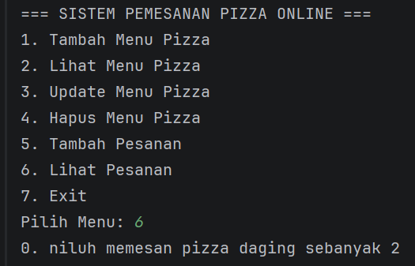

# Sistem Pemesanan Pizza Online

## Deskripsi
Program ini merupakan sistem sederhana untuk mengelola pemesanan pizza menggunakan bahasa Java dengan konsep Object Oriented Programming (OOP)
Program menggunakan ArrayList untuk menyimpan data dan memiliki fitur CRUD.

## Class yang Digunakan
1. Pizza(Superclass)
2. PizzaReguler(Subclass)
3. PizzaPremium(Subclass)
4. Transaksi(interface)
5. Pesanan
6. Main

## Fitur Program
SISTEM PEMESANAN PIZZA ONLINE
1. Tambah Menu Pizza
2. Lihat Menu Pizza
3. Update Menu Pizza
4. Hapus Menu Pizza
5. Tambah Pesanan
6. Lihat Pesanan
7. Exit

### Manajemen Menu Pizza
- Tambah menu pizza
- Lihat menu pizza
- Update menu pizza
- Hapus menu pizza

### Manajemen Pesanan
- Tambah pesanan
- Lihat pesanan

## Konsep yang Digunakan
- Class dan Object
- Constructor
- Method
- ArrayList
- Perulangan (Loop)
- Switch Case
- CRUD
- Menerapkan konsep Polymorphism (fungsi overloading dan fungsi override)
- Mengubah kelas Parent/Super pada inheritance menjadi Kelas Abstrak / Abstract Class
- Menerapkan abstract method pada class abstract
- Membuat class interface dan implementasikan pada program
- Memiliki 2 method (method yang ada didalam class interfacenya)

## Menggunakan Inheritance
- Superclass (Parent Class) → class induk
- Subclass (Child Class) → class turunan Hierarchical Inheritance: Yaitu satu superclass memiliki lebih dari satu subclass.
  Contoh pada project:
- Pizza → PizzaReguler
- Pizza → PizzaPremium Inheritance diterapkan pada class: 

## Cara Menjalankan Program
Compile program: jalankan program

## ss program
## tambah menu program

## lihat menu program

## update menu program

## hapus menu program

## tambah pesanan program

## lihat pesanan program

## exitprogram

